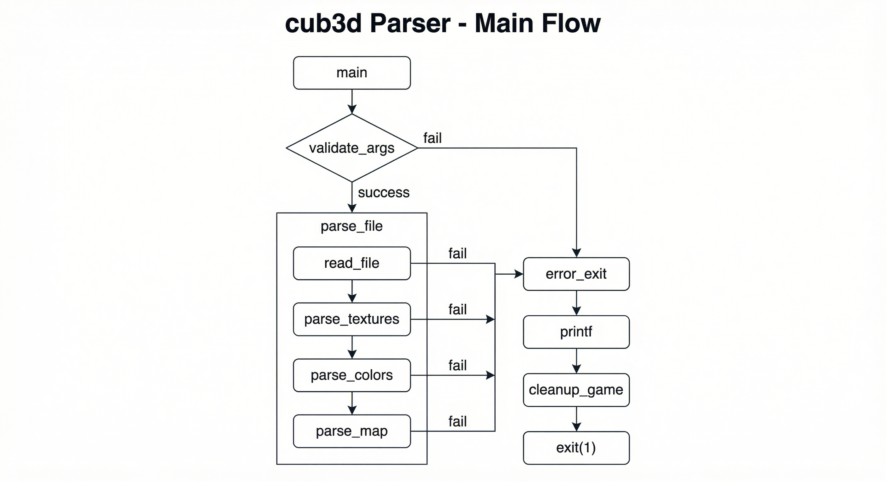

# cub3d Parser - Detaylı Akış Diyagramları

Bu döküman parser'ın tüm adımlarını, hata senaryolarını ve veri akışını açıklar.

---

## 1. Ana Program Akışı



**Akış:** main → validate_args → parse_file → validate_map → init_game → start_game → cleanup_game  
**Hata:** Herhangi bir adım başarısız olursa → error_exit (printf → cleanup_game → exit 1)

---

## 2. Argüman Doğrulama (validate_args)

**Kontrol edilenler:**
- Tam 1 argüman olmalı (program adı + dosya yolu)
- Dosya adı `.cub` uzantısıyla bitmeli

---

## 3. parse_file - Genel Parsing Akışı

read_file → parse_textures → parse_colors → parse_map (start=6)  
Herhangi biri 0/NULL dönerse → main error_exit çağırır

---

## 4. read_file - Dosya Okuma Detayı

open fd → gc_malloc 1000 slot → simple_get_line döngüsü (static buffer 999 byte) → boş satırlar atlanır, dolu satırlar gc_track ile eklenir → close fd → return lines

**Notlar:**
- Boş satırlar atlanır (dosyaya eklenmez)
- Static buffer ile 1000 byte blok okuma
- Bellek GC ile yönetilir

---

## 5. parse_textures - Texture Parsing


**Token eşleştirme:** NO → north, SO → south, WE → west, EA → east (satır+3 = path)  
**Eksik texture:** Herhangi biri yoksa printf + return 0

**Beklenen format:**
```
NO ./textures/north.xpm
SO ./textures/south.xpm
WE ./textures/west.xpm
EA ./textures/east.xpm
```

---

## 6. parse_colors - Renk Parsing

F ve C token'ları: ft_split(line+2, ',') ile RGB ayrıştırılır. Duplicate F/C, virgül hatası, 0-255 dışı değer = hata.

### parse_color_line - RGB Doğrulama

has_consecutive_commas → ft_split virgül → 3 değer kontrolü → is_valid_rgb_token → 0-255 aralığı → create_rgb

**Geçerli format:** `F 220,100,0` veya `C 0,0,128`

**Hatalar:**
- Arka arkaya virgül: `F 255,,0`
- Eksik/fazla değer: `F 255,0` veya `F 255,0,0,0`
- Geçersiz karakter: `F 255,0,abc`
- Aralık dışı: `F 300,0,0` (255'ten büyük)

---

## 7. parse_map - Harita Parsing


i=6'dan başla → is_map_line ile ilk map satırını bul → ardışık map satırlarını kopyala → find_player_position (tam 1 N/S/E/W olmalı) → player hücresini 0 yap

### is_map_line - Geçerli Harita Karakterleri

Sadece şunlar kabul edilir: `0` `1` `N` `S` `E` `W` ` ` (boşluk)

### find_player_position

Grid'de N/S/E/W ara → ilk bulunanı kaydet → o hücreyi 0 yap → count döndür (1 olmalı)

---

## 8. validate_map - Harita Doğrulama (Flood Fill)

Boyut >= 3x3 → player var → grid sadece 0,1,space → flood_fill player'dan başla → sınır dışına çıkarsa ERR_MAP_NOT_CLOSED

### flood_fill_check - Duvar Kapalılık Kontrolü

Player'dan 4 yönde (x+1, x-1, y+1, y-1) DFS. is_valid_pos false = sınırı aştık = duvar yok = map açık = return 0. Duvar veya zaten ziyaret = return 1.

**Mantık:** Player'dan başlayıp 4 yönde (sağ, sol, aşağı, yukarı) ilerlenir. Eğer `is_valid_pos` false dönerse (sınırları aştık) demek ki boşluktan dışarı çıkılabiliyor - harita duvarlarla kapatılmamış.

---

## 9. Hata Senaryoları Özeti


| Hata | Nerede | Sonuç |
|------|--------|-------|
| Argüman sayısı yanlış | validate_args | return 1, program biter |
| .cub değil | validate_args | return 1 |
| Dosya açılamadı | read_file | parse_file 0, error_exit, exit(1) |
| NO/SO/WE/EA eksik | parse_textures | printf + return 0, error_exit |
| F/C duplicate | parse_colors | printf + return 0, error_exit |
| F/C format hatalı | parse_color_line | printf + return 0, error_exit |
| RGB 0-255 dışı | parse_color_line | printf + return 0, error_exit |
| Harita boş | parse_map | printf + return 0, error_exit |
| Player yok/çok fazla | parse_map | printf + return 0, error_exit |
| Harita çok küçük | validate_map | printf + return 0, error_exit |
| Harita açık (duvar yok) | flood_fill | printf ERR_MAP_NOT_CLOSED, error_exit |
| Texture yüklenemez | init_game | error_exit ERR_TEXTURE_LOAD |

---

## 10. error_exit - Hata Anında Ne Olur?

printf(message) → cleanup_game(game) → GC ile tüm allocationlar free → exit(1)

**Önemli:** Parser fonksiyonları hata mesajlarını kendi `printf` ile yazıyor. `error_exit` çağrılırken `message` boş string `""` geçiriliyor - yani ek mesaj yok, parse fonksiyonları zaten yazdı.
